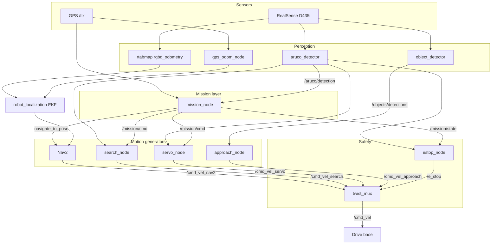
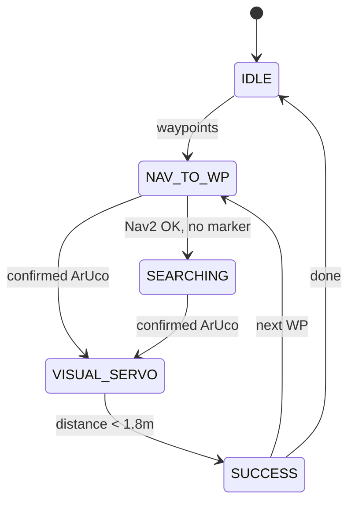

# URC CV — University Rover Challenge 2026 Autonomy

ROS 2 (Humble) software for autonomous navigation, ArUco marker acquisition, visual servoing, object detection, and safety monitoring for a URC 2026 competition rover.

The stack is launched as a single graph via `autonomy.launch.py`. A **mission state machine** coordinates GPS/Nav2 driving, marker search, and closed-loop visual approach. Perception nodes run in parallel; **twist_mux** selects which motion source reaches the drive base, with **e-stop** able to halt everything.

| Doc | What you get |
|-----|----------------|
| **This README** | Overview, quick start, topics, tests |
| **[docs/ARCHITECTURE.md](docs/ARCHITECTURE.md)** | **Internals** — FSM entry/exit, PID math, ArUco gating, mux timing, message schemas, debugging |
| [docs/README.md](docs/README.md) | Documentation index |
| [training/README.md](training/README.md) | YOLO dataset & training |

---

## Architecture (overview)

### High-level data flow



### Design principles

| Principle | How it is implemented |
|-----------|------------------------|
| **Separation of concerns** | Mission logic does not compute velocities; behavior nodes do not know GPS waypoints. |
| **JSON over `std_msgs/String`** | Detections and commands are JSON payloads for easy debugging (`ros2 topic echo`). |
| **Command gating** | Search and servo only run when `mission_node` publishes `START_SEARCH` / `START_SERVO`. |
| **Priority-based motion** | `twist_mux` picks the highest-priority active `cmd_vel_*` stream; e-stop lock overrides all. |
| **Confirmed perception** | ArUco must pass multi-frame gating before `confidence: "confirmed"` affects the mission. |

### Mission flow (summary)



1. Operator loads GPS waypoints → **NAV_TO_WP** (Nav2 drives in map frame).
2. If marker seen early → **VISUAL_SERVO**; else after Nav2 succeeds → **SEARCHING** (arc scan).
3. Confirmed ArUco → **VISUAL_SERVO** (PID on bearing/distance).
4. Close enough → **SUCCESS** → next waypoint or **IDLE**.

**→ Full internals:** [docs/ARCHITECTURE.md](docs/ARCHITECTURE.md) — state entry/exit, PID math, ArUco gating, mux priorities, JSON schemas, debugging.

```bash
./scripts/load_waypoints.sh waypoints/example_waypoints.json
```

---

## ROS packages

| Package | Role |
|---------|------|
| `urc_autonomy` | Mission state machine, e-stop, telemetry, Nav2 launch, mux config |
| `aruco_detector` | ArUco detection + depth validation |
| `visual_servo` | Marker approach PID |
| `search_behavior` | Post-waypoint search pattern |
| `urc_localization` | RTAB-Map visual odom launch + GPS odometry |
| `object_detector` | YOLOv8 onboard inference |
| `object_approach` | Science object approach controller |
| `urc_simulation` | Gazebo field + sim launch |

---

## Key topics

| Topic | Type | Publisher | Purpose |
|-------|------|-----------|---------|
| `/mission/waypoints` | `String` (JSON) | operator / loader | Waypoint list |
| `/mission/state` | `String` | mission_node | FSM state + estop heartbeat |
| `/mission/cmd` | `String` (JSON) | mission_node | `START_SEARCH`, `START_SERVO`, … |
| `/aruco/detection` | `String` (JSON) | aruco_detector | Marker pose + confidence |
| `/objects/detections` | `String` (JSON) | object_detector | YOLO detections |
| `/cmd_vel_*` | `Twist` | behaviors / Nav2 | Per-behavior velocity |
| `/cmd_vel` | `Twist` | twist_mux | Final command to base |
| `/e_stop` | `Bool` | estop_node | Mux emergency stop |
| `/fix` | `NavSatFix` | GPS driver | Global position |
| `/gps/odom` | `Odometry` | gps_odom_node | GPS in map frame |

---

## Requirements

- **On-robot / Linux:** Ubuntu 22.04, ROS 2 Humble, Intel RealSense, Nav2, `robot_localization`, `twist_mux`, RTAB-Map
- **Dev (optional):** Docker + Docker Compose
- **Training:** Python 3.10+, Ultralytics — see [`training/README.md`](training/README.md)

---

## Quick start (Docker)

```bash
./scripts/build_dev.sh
docker compose run --rm dev

# Inside container:
source /opt/ros/humble/setup.bash
source /ros2_ws/install/setup.bash
ros2 launch urc_autonomy autonomy.launch.py
```

Or: `./scripts/run_stack.sh`

## Native build

```bash
cd ros2_ws
source /opt/ros/humble/setup.bash
colcon build --symlink-install
source install/setup.bash
ros2 launch urc_autonomy autonomy.launch.py
```

### Simulation

```bash
ros2 launch urc_simulation sim.launch.py
ros2 launch urc_autonomy autonomy.launch.py \
  use_sim_time:=true launch_realsense:=false object_detector_device:=cpu
```

---

## Tests

Integration tests inject fake messages (no hardware):

```bash
cd ros2_ws
colcon build --packages-select urc_autonomy visual_servo
source install/setup.bash
colcon test --packages-select urc_autonomy --event-handlers console_direct+
colcon test-result --verbose
```

---

## Training (YOLO)

```bash
pip install -r requirements.txt
cd training
python train.py
python validate.py --model ../models/urc_objects/weights/best.pt
python export.py --model ../models/urc_objects/weights/best.pt   # TensorRT on Jetson
```

---

## Repository layout

```text
.
├── docs/                 # Deep-dive docs (start at ARCHITECTURE.md)
├── ros2_ws/src/          # ROS 2 packages
├── training/             # YOLO train / validate / export
├── datasets/             # Labeled images
├── models/               # Weights & TensorRT engines
├── waypoints/            # Mission waypoint JSON
├── scripts/              # Helper shell scripts
├── tools/                # Dev utilities (mac_stress.py)
├── requirements.txt
├── Dockerfile
└── docker-compose.yml
```

### What is tracked in git

Source, configs, tests, and scaffolding are tracked. Ignored: colcon `build/`/`install/`/`log/`, `__pycache__`, recorded bags under `urc_logs/`, `.env`.

Datasets and model weights are **not** gitignored — commit when ready; use Git LFS for files > ~100 MB.

---

## Scripts

| Script | Purpose |
|--------|---------|
| `scripts/build_dev.sh` | Build Docker image |
| `scripts/run_stack.sh` | `docker compose up autonomy` |
| `scripts/load_waypoints.sh` | Publish waypoints to mission node |
| `scripts/collect_data.sh` | Record training images |
| `scripts/status.sh` | Topic/node health check |

---

## License

MIT — see [LICENSE](LICENSE).
