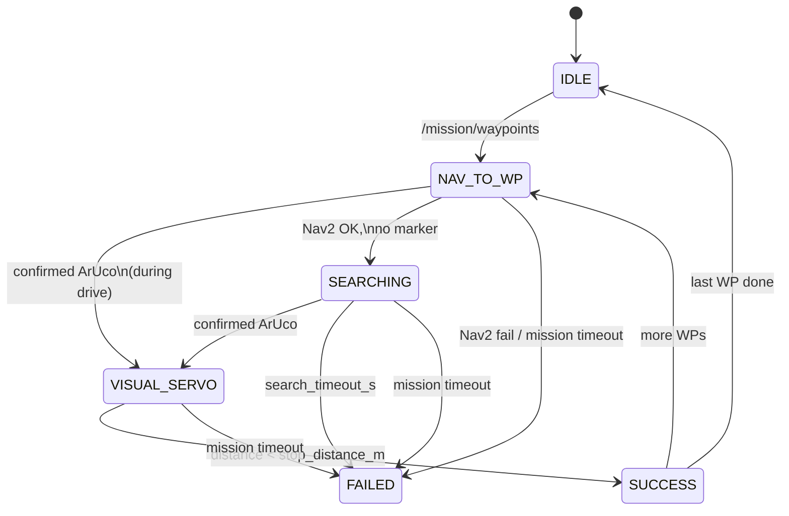

# Architecture — internals & behavior

This document explains **how the URC 2026 autonomy stack actually works** inside each node: state transitions, control math, message contracts, timing, and failure modes. For setup and commands, see the [root README](../README.md).

---

## Table of contents

1. [System context](#1-system-context)
2. [Timing and process model](#2-timing-and-process-model)
3. [Frames, GPS, and Nav2 goals](#3-frames-gps-and-nav2-goals)
4. [Mission state machine (`mission_node`)](#4-mission-state-machine-mission_node)
5. [ArUco detector (`aruco_detector`)](#5-aruco-detector-aruco_detector)
6. [Search behavior (`search_node`)](#6-search-behavior-search_node)
7. [Visual servo (`servo_node`)](#7-visual-servo-servo_node)
8. [Object detection & approach](#8-object-detection--approach)
9. [E-stop (`estop_node`)](#9-e-stop-estop_node)
10. [Velocity multiplexing (`twist_mux`)](#10-velocity-multiplexing-twist_mux)
11. [Localization & EKF](#11-localization--ekf)
12. [Telemetry](#12-telemetry)
13. [Message reference](#13-message-reference)
14. [Launch graph](#14-launch-graph)
15. [Edge cases & debugging](#15-edge-cases--debugging)
16. [Parameter cheat sheet](#16-parameter-cheat-sheet)

---

## 1. System context

The stack solves **autonomous navigation to GPS waypoints** followed by **finding and driving to a URC ArUco marker** (20 cm, `DICT_4X4_50`). A parallel path supports **YOLO-based science object approach** (mallet, rock pick, water bottle).

Responsibilities are split deliberately:

| Layer | Responsibility | Does *not* do |
|-------|----------------|---------------|
| **Perception** | Estimate bearing/distance to markers or objects | Command motors |
| **Mission** | FSM, waypoint index, Nav2 goals, behavior commands | PID, image processing |
| **Behaviors** | Produce `Twist` for one task | Know global mission state |
| **Mux + E-stop** | Select safe velocity, emergency halt | Plan paths |
| **Nav2** | Global/local planning to map goals | ArUco logic |

All behavior coordination uses two buses:

- **`/mission/state`** — discrete FSM state (also e-stop heartbeat).
- **`/mission/cmd`** — JSON commands (`START_SEARCH`, `START_SERVO`, …).

---

## 2. Timing and process model

| Node | Main loop | Rate |
|------|-----------|------|
| `mission_node` | `_tick` timer | 10 Hz |
| `mission_node` | `_publish_state` | 2 Hz |
| `aruco_detector` | camera callback | ~30 Hz (camera bound) |
| `search_node` | `_tick` timer | 20 Hz |
| `servo_node` | `_control_timer_cb` | 20 Hz |
| `approach_node` | `_control_timer_cb` | 20 Hz |
| `estop_node` | `_estop_tick` | 10 Hz |
| `object_detector` | timer + camera | 15 Hz publish (param) |

**Important:** Mission logic runs at 10 Hz; servo/search at 20 Hz. A confirmed ArUco message can arrive between mission ticks — the mission still transitions on the next callback or detection handler (detection is event-driven, distance-based SUCCESS is checked in `_tick`).

**QoS note:** `/mission/waypoints` uses **transient-local** durability so a node that starts after the operator publishes waypoints still receives the list.

---

## 3. Frames, GPS, and Nav2 goals

### 3.1 Flat-earth GPS → map

Both `mission_node` and `gps_odom_node` anchor on the **first valid** `NavSatFix` on `/fix`:

```
lat0, lon0 = first fix
x = Δlon_rad × cos(lat0_rad) × R_earth
y = Δlat_rad × R_earth
```

`R_earth = 6_371_000 m`. Z is always 0; yaw goal for Nav2 is fixed at 0 unless changed.

This is accurate enough for short URC runs (tens–hundreds of meters). Long baselines would need a proper projection (UTM).

### 3.2 Dual use of GPS

| Consumer | Topic in | Topic out | Purpose |
|----------|----------|-----------|---------|
| `gps_odom_node` | `/fix` | `/gps/odom` | Fuse into EKF → Nav2 localization |
| `mission_node` | `/fix` | (internal) | Convert waypoint lat/lon → `NavigateToPose` |

Anchors are **independent copies** in each node (same algorithm, same first-fix semantics if `/fix` is shared).

### 3.3 Nav2 action interface

`mission_node` is an **action client** for `navigate_to_pose`:

1. Build `PoseStamped` in `map` frame.
2. `send_goal_async` → `_nav_goal_pending = True`.
3. On accept → store goal handle, register result callback.
4. On result while still in `NAV_TO_WP`:
   - `SUCCEEDED` + no marker → `SEARCHING`
   - `SUCCEEDED` + marker already confirmed → `VISUAL_SERVO` (redundant if early lock already fired)
   - Other status → `FAILED`
5. Entering `VISUAL_SERVO` or re-loading waypoints **cancels** the active Nav2 goal.

---

## 4. Mission state machine (`mission_node`)

Source: `urc_autonomy/mission_node.py`

### 4.1 State diagram (with side effects)



### 4.2 Per-state behavior

#### IDLE

- No Nav2 goals, no search/servo commands.
- Publishes `IDLE` on `/mission/state` every 0.5 s.

#### NAV_TO_WP

**On enter:**

- Clears `_marker_confirmed` and `_latest_distance_m`.
- Calls `_send_nav_goal()` if GPS anchor exists and Nav2 server is up.

**While running:**

- Subscribes to confirmed ArUco → may transition to `VISUAL_SERVO` immediately (cancels Nav2 on exit).
- `_tick` re-sends Nav2 goal if anchor arrived late, or goal handle was cleared without pending send.

**On exit:** Cancels active Nav2 goal.

#### SEARCHING

**On enter:** Records `_search_start_monotonic`, publishes `{"cmd":"START_SEARCH"}`.

**While running (`_tick` at 10 Hz):**

- If `_marker_confirmed` → `VISUAL_SERVO`.
- Else if `now - _search_start > search_timeout_s` (default 45 s) → `FAILED`.

**On exit:** Publishes `STOP_SEARCH`.

Search node stops itself when it sees confirmed ArUco, but **mission** only leaves `SEARCHING` via `_marker_confirmed` set in `_detection_cb`.

#### VISUAL_SERVO

**On enter:** `START_SERVO`.

**While running:**

- `_detection_cb` updates `_latest_distance_m` on each confirmed message.
- `_tick`: if `_latest_distance_m < stop_distance_m` (default 1.8) → `SUCCESS`.

**On exit:** `STOP_SERVO`.

#### SUCCESS

**On enter:** Cancel Nav2; set `_advance_pending = True` (do not advance index yet).

**Next `_tick`:** `_advance_waypoint()`:

- Increment index; clear marker flags.
- If index ≥ len(waypoints) → clear mission timer, `IDLE`.
- Else → `NAV_TO_WP` again.

#### FAILED

Terminal until new waypoints published (which forces `NAV_TO_WP` from callback — effectively restarts mission).

### 4.3 Detection callback logic

```python
if confidence != "confirmed":
    return  # pending / lost frames do not affect mission

update _latest_distance_m

if state in (NAV_TO_WP, SEARCHING) and not _marker_confirmed:
    _marker_confirmed = True
    if state == NAV_TO_WP:
        transition to VISUAL_SERVO

if state == VISUAL_SERVO:
    pass  # only distance updates; SUCCESS in _tick
```

**Consequence:** A single-frame glitch cannot start servo; ArUco node must emit `confirmed`.

### 4.4 Timers

| Timer | Default | Effect |
|-------|---------|--------|
| `search_timeout_s` | 45 | Max time in `SEARCHING` |
| `total_mission_timeout_s` | 600 | Wall clock from first waypoint load; ignored in `IDLE`/`FAILED` |

### 4.5 Internal flags

| Flag | Meaning |
|------|---------|
| `_nav_goal_pending` | Async send in flight |
| `_nav_goal_handle` | Accepted Nav2 goal |
| `_marker_confirmed` | Saw confirmed ArUco this waypoint leg |
| `_advance_pending` | SUCCESS entered; advance WP on next tick |
| `_gps_anchor` | First fix lat/lon for conversions |

---

## 5. ArUco detector (`aruco_detector`)

Source: `aruco_detector/detector_node.py`

### 5.1 Pipeline (per frame)

```
BGR image → gray
    → ArucoDetector (raw gray)
    → optional CLAHE branch (merge IDs not in raw)
For each marker ID:
    solvePnP (IPPE_SQUARE, 20cm square model)
    → distance_m, bearing_deg
    depth sample at marker center (aligned depth)
    → depth_m, depth_validated
    multi-frame gate → pending | confirmed
    if confirmed → publish JSON
debug image → /aruco/debug_image
```

### 5.2 Pose math

Object points (marker frame, Z=0 plane, half-size 0.10 m):

```
(-h,h,0), (h,h,0), (h,-h,0), (-h,-h,0)
```

`solvePnP` → `tvec = [x, y, z]` camera frame:

- `distance_m = ||tvec||`
- `bearing_deg = atan2(x, z)` degrees  
  - Positive bearing ⇒ marker appears to the **right** of optical axis.

### 5.3 Depth validation

Samples `16UC1` depth at marker center (scaled if depth/color resolution differ).

| Condition | `depth_validated` |
|-----------|-------------------|
| No depth | `true` (PnP only) |
| \|depth - pnp\| ≤ 15% of pnp distance | `true` |
| Else | `false` (overlay orange on debug) |

Mission ignores `depth_validated`; it is for operators/debugging.

### 5.4 Multi-frame gate

Per `marker_id`, state machine:

```
pending:
  streak++ each seen frame
  keep last confirm_frames bearings
  if streak >= confirm_frames AND bearings within ±5°:
      → confirmed (latched)

confirmed:
  publish every frame while visible
  lost_streak on missing frames
  if lost_streak >= loss_frames (default 5):
      drop track entirely
```

Only **confirmed** tracks publish to `/aruco/detection`. Pending detections are drawn on debug image but **not** published — this is why `test_pending_detection_ignored` passes.

Parameters: `confirm_frames=3`, `loss_frames=5`, `use_clahe=true`.

---

## 6. Search behavior (`search_node`)

Source: `search_behavior/search_node.py`

Activated only by `START_SEARCH` / `STOP_SEARCH` on `/mission/cmd`.

### 6.1 Phases

| Phase | Duration / end condition | Twist |
|-------|--------------------------|-------|
| **ROTATE** | 3 s wall time | `ω = +rotate_speed` (default 0.3 rad/s), `v = 0` |
| **ARC_CCW** | integrated \|ω\|dt ≥ π | `v = R×ω`, `ω = +arc_omega` (default R=4 m, ω=0.12) |
| **ARC_CW** | integrated \|ω\|dt ≥ π | `v = R×ω`, `ω = -arc_omega` |
| **done** | after CW arc | publish `/search/status` FAILED, stop |

If **confirmed** ArUco appears on `/aruco/detection` during any phase → zero velocity, `FOUND` status, return INACTIVE. Mission must still receive confirmed detection separately.

Global cap: `search_timeout_s` (param, default 45) from search start — calls `_on_timeout`.

### 6.2 Interaction with mission

Mission enters `SEARCHING` when Nav2 succeeds without prior marker lock. Mission’s own `search_timeout_s` is separate but should match search node param for coherent behavior.

---

## 7. Visual servo (`servo_node`)

Source: `visual_servo/servo_node.py`

Inactive until `START_SERVO`; publishes **zero** `Twist` at 20 Hz when inactive (keeps mux timeout from stale high-priority cmd).

### 7.1 Control loop

```
if not active → zero
if detection older than detection_timeout_s (1.5) → zero
else:
    ω = PID(bearing)
    v = profile(bearing, distance)
    if obstacle in depth cone → v = 0
publish /cmd_vel_servo
```

Subscribes to **any** detection JSON with `bearing_deg` + `distance_m` (does not re-check `confidence` — mission already gated).

### 7.2 Angular PID

```
error = -bearing_deg          # steer marker to center
P = kp * error                # default kp = 0.03
I = ki * ∫error dt            # default ki = 0.0005, clamped anti-windup
D = kd * d(error)/dt          # default kd = 0.008
ω = clamp(P+I+D, ±max_angular)   # default max 0.6 rad/s
```

Deadband: \|bearing\| < 1.5° → ω = 0, reset D/I state.

**ROS convention:** Positive bearing (marker right) → negative `angular.z` → turn right.

### 7.3 Linear speed profile

| Condition | `linear.x` |
|-----------|------------|
| \|bearing\| > 20° | 0 (align first) |
| distance < `stop_distance_m` (1.8) | 0 |
| distance < 2.5 m | 0.10 m/s cruise |
| 2.5 m – 5.0 m | linear ramp 0.15 → `max_linear` (0.4) |
| distance > 5.0 m | `max_linear` |
| obstacle in forward depth strip | 0 |

Obstacle strip: middle third of image rows, center ± `obstacle_cone_width_frac` (25%) of width; any valid depth < 1.2 m ⇒ halt forward motion.

### 7.4 Stale detection safety

If no `/aruco/detection` for > 1.5 s while active, publish zeros. Prevents driving blind after marker occlusion.

---

## 8. Object detection & approach

### 8.1 `object_detector_node`

- Loads Ultralytics YOLO from `model_path` (default `models/urc_objects.pt`).
- Classes: `0=mallet`, `1=rock_pick`, `2=water_bottle`.
- Publishes JSON **array** on `/objects/detections` at `publish_rate_hz` (15).
- Each entry includes bbox, `class_name`, `confidence`, `bearing_deg`, `distance_m` (depth-assisted, similar to ArUco).

If model file missing → warns and publishes empty arrays.

### 8.2 `approach_node`

Mirror of visual servo but:

- Input: `/objects/detections` list; picks **best confidence** for `target_class` above `min_confidence`.
- Commands: `START_APPROACH` / `STOP_APPROACH` on `/mission/cmd` (optional `target` in JSON).
- Output: `/cmd_vel_approach`, status on `/approach/status`.
- Tighter stop distance (0.8 m default), slower `max_linear` (0.3).

**Not wired into mission FSM today** — science tasks can be triggered manually or by future mission states.

---

## 9. E-stop (`estop_node`)

Evaluated at 10 Hz; publishes `/e_stop` Bool every tick.

```
active = manual_latched OR heartbeat_lost OR marker_too_close
```

| Trigger | Mechanism |
|---------|-----------|
| **Manual** | `/estop/trigger` true → latched until false |
| **Heartbeat** | No message on `/mission/state` for `heartbeat_timeout_s` (3 s). Uses node start time until first heartbeat. |
| **Proximity** | Any `/aruco/detection` with `distance_m` < `min_marker_distance_m` (0.5) |

`/estop/status` JSON every ~1 s: `{ "active": bool, "reasons": [...] }`.

`twist_mux` **lock** on `/e_stop` priority 255 forces zero cmd_vel regardless of behavior streams.

---

## 10. Velocity multiplexing (`twist_mux`)

Config: `urc_autonomy/config/twist_mux.yaml`

```
Priority (high wins):  e_stop lock (255) > servo (20) > approach (18) > search (15) > nav2 (10)
```

Each source has a **timeout**: if messages stop, mux drops that source and falls through.

Example sequence at one waypoint:

1. Nav2 publishes `/cmd_vel_nav2` → base moves.
2. Mission → `VISUAL_SERVO`, servo publishes `/cmd_vel_servo` → overrides Nav2 (higher priority).
3. E-stop fires → all motion stopped until cleared.

Nav2 is remapped to `/cmd_vel_nav2` in launch so it does not collide with mux output `/cmd_vel`.

---

## 11. Localization & EKF

### 11.1 Visual odometry

`visual_odom.launch.py` runs RTAB-Map `rgbd_odometry` on RealSense topics → `/odom` (visual).

### 11.2 GPS odometry

`gps_odom_node` → `/gps/odom` (map pose from `/fix`).

### 11.3 `robot_localization` EKF

`config/ekf.yaml` (2D mode):

| Input | Fused quantities |
|-------|------------------|
| `/gps/odom` | x, y position |
| `/odom` (visual) | vx, vyaw |
| `/camera/imu` | yaw, vyaw |

Output filtered state for Nav2 costmaps and planners in `map` / `odom` / `base_link`.

---

## 12. Telemetry

`telemetry_node` writes `~/urc_logs/run_YYYYMMDD_HHMMSS.csv`:

| Column | Content |
|--------|---------|
| `timestamp_s` | Monotonic since node start |
| `event_type` | e.g. `mission_state`, `aruco_detection`, `estop` |
| `data` | JSON blob |

Also publishes live summary JSON for monitoring. Subscribes to mission state, ArUco, objects, GPS, estop.

---

## 13. Message reference

### `/mission/waypoints` (JSON array)

```json
[{"lat": 38.4068, "lon": -110.7916}]
```

### `/mission/cmd`

```json
{"cmd": "START_SEARCH"}
{"cmd": "STOP_SEARCH"}
{"cmd": "START_SERVO"}
{"cmd": "STOP_SERVO"}
{"cmd": "START_APPROACH", "target": "mallet"}
{"cmd": "STOP_APPROACH"}
```

### `/aruco/detection` (confirmed only)

```json
{
  "id": 0,
  "distance_m": 10.0,
  "bearing_deg": 2.5,
  "depth_m": 10.1,
  "depth_validated": true,
  "confidence": "confirmed"
}
```

### `/objects/detections` (array)

```json
[
  {
    "class_name": "mallet",
    "confidence": 0.87,
    "bearing_deg": -4.2,
    "distance_m": 3.1,
    "bbox": [120, 80, 200, 160]
  }
]
```

### `/search/status`

```json
{"status": "FOUND", "phase": 2}
{"status": "FAILED"}
```

---

## 14. Launch graph

`ros2 launch urc_autonomy autonomy.launch.py` starts:

| Node | Package |
|------|---------|
| `telemetry_node` | urc_autonomy |
| `realsense2_camera_node` | realsense2_camera |
| `rtabmap_odometry` | rtabmap_ros (via include) |
| `gps_odom_node` | urc_localization |
| `detector_node` | aruco_detector |
| `mission_node` | urc_autonomy |
| `estop_node` | urc_autonomy |
| `servo_node` | visual_servo |
| `search_node` | search_behavior |
| `twist_mux` | twist_mux |
| `ekf_filter_node` | robot_localization |
| Nav2 stack | nav2_bringup |
| `object_detector_node` | object_detector |
| `approach_node` | object_approach |

---

## 15. Edge cases & debugging

| Symptom | Likely cause | What to check |
|---------|--------------|---------------|
| Stuck in `NAV_TO_WP`, no Nav2 | No GPS anchor | `ros2 topic echo /fix` |
| Nav2 never starts | Action server down | `ros2 action list` → `navigate_to_pose` |
| Never enters `VISUAL_SERVO` | Only pending ArUco | `/aruco/debug_image`, lower `confirm_frames` |
| Servo zeros immediately | Stale detections | detection rate vs `detection_timeout_s` |
| Immediate e-stop | Heartbeat or too-close | `/estop/status`, marker distance < 0.5 m |
| Search then FAILED | No marker in FOV | camera mount, `search_timeout_s`, lighting (CLAHE) |
| SUCCESS too early | Wrong distance | PnP scale (`MARKER_SIZE_M`), depth mismatch |
| Mux ignores servo | Timeout / priority | `ros2 topic hz /cmd_vel_servo` |
| Science approach dead | Not activated | publish `START_APPROACH` manually |

**Useful commands:**

```bash
ros2 topic echo /mission/state
ros2 topic echo /mission/cmd
ros2 topic echo /aruco/detection
ros2 topic echo /estop/status
ros2 run rqt_image_view rqt_image_view /aruco/debug_image
```

---

## 16. Parameter cheat sheet

### Mission (`mission_node`)

| Parameter | Default | Effect |
|-----------|---------|--------|
| `search_timeout_s` | 45 | Max SEARCHING duration |
| `total_mission_timeout_s` | 600 | Mission wall clock |
| `stop_distance_m` | 1.8 | SUCCESS threshold |

### ArUco (`detector_node`)

| Parameter | Default | Effect |
|-----------|---------|--------|
| `confirm_frames` | 3 | Frames to confirm |
| `loss_frames` | 5 | Frames lost before drop |
| `use_clahe` | true | Desert contrast boost |

### Servo (`servo_node`)

| Parameter | Default | Effect |
|-----------|---------|--------|
| `kp_bearing` / `ki` / `kd` | 0.03 / 0.0005 / 0.008 | PID |
| `stop_distance_m` | 1.8 | Stop forward motion |
| `detection_timeout_s` | 1.5 | Stale cutoff |
| `obstacle_halt_distance_m` | 1.2 | Depth halt |

### E-stop (`estop_node`)

| Parameter | Default | Effect |
|-----------|---------|--------|
| `heartbeat_timeout_s` | 3 | Mission heartbeat |
| `min_marker_distance_m` | 0.5 | Proximity trip |

### Search (`search_node`)

| Parameter | Default | Effect |
|-----------|---------|--------|
| `arc_radius_m` | 4.0 | Arc path radius |
| `arc_omega_rad` | 0.12 | Arc angular rate |
| `rotate_speed_rad` | 0.3 | Phase 1 spin rate |

---

*Document version matches stack in `main` branch. When changing node logic, update this file alongside code.*
