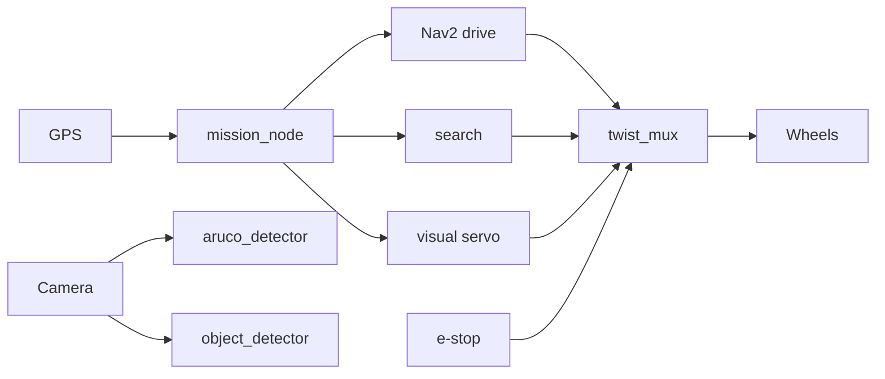
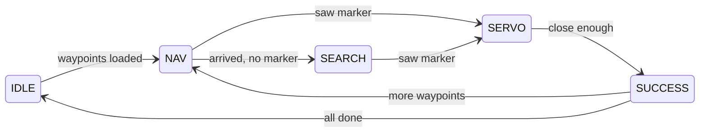

# Team guide — start here

**Audience:** Teammates who did not write this code.  
**Goal:** Understand what the rover software does, how the pieces fit together, and what you can do on day one without reading every source file.

If you only read one doc before a meeting, read this one. Then skim [GLOSSARY.md](GLOSSARY.md) for terms you do not know.

---

## What problem are we solving?

At URC, the rover must often:

1. **Drive to a GPS location** on the field (waypoint).
2. **Find a visual target** — for this stack, an **ArUco marker** (printed square fiducial).
3. **Drive up to it precisely** — close enough to score or interact.
4. **(Separately)** Recognize science objects (mallet, rock pick, water bottle) with a camera + ML.

This repository is the **autonomy software** for those jobs: ROS 2 nodes that read sensors, decide what to do, and send velocity commands to the wheels.

We are **not** building the physical rover here — we are building the **brain** that runs on the Jetson (or a dev laptop in Docker).

---

## The one-sentence version

> GPS tells us *where* to go; the camera tells us *what* we see; **mission_node** decides *which task* we are doing; behavior nodes compute *how to move*; **twist_mux** picks one driver command; **e-stop** can stop everything.

---

## Big picture (non-technical)

Think of the stack like a team of specialists with a manager:

| Role | Software | Plain English |
|------|----------|---------------|
| **Manager** | `mission_node` | “Go to waypoint 2, then find the marker, then finish.” |
| **Driver (GPS)** | Nav2 | Drives along a planned path on a map. |
| **Lookout (marker)** | `aruco_detector` | “I see marker #0, 8 meters ahead, slightly to the left.” |
| **Lookout (objects)** | `object_detector` | “I see a mallet at 3 meters.” |
| **Search party** | `search_node` | “We’re at the waypoint but don’t see the marker — I’ll spin and arc to look.” |
| **Fine approach** | `servo_node` | “I’ll steer and creep forward until we’re close to the marker.” |
| **Science approach** | `approach_node` | Same idea, but for a YOLO object class. |
| **Traffic cop** | `twist_mux` | Only one specialist steers at a time. |
| **Safety officer** | `estop_node` | Hits the brakes if something is wrong. |



---

## What is ROS 2? (30 seconds)

**ROS 2** (Robot Operating System 2) is a framework for robot software:

- Programs are **nodes** (separate processes).
- Nodes talk over **topics** (named streams of messages), e.g. `/mission/state`.
- A **launch file** starts many nodes at once — we use `autonomy.launch.py`.

You do not need to be a ROS expert to help on the team. You *do* need to know that **if the stack is running, many nodes are running together**, and you can **inspect** them with command-line tools (see [GETTING_STARTED.md](GETTING_STARTED.md)).

---

## The mission story (what happens on the field)

This is the main behavior your teammates should remember.

### Step 0 — Idle

Rover is waiting. Operator (or script) sends **waypoints** — a list of latitude/longitude pairs.

### Step 1 — Drive to waypoint (`NAV_TO_WP`)

- Software converts GPS → a point on an internal **map**.
- **Nav2** plans a path and drives there.
- Camera is already looking for the ArUco marker. If we see a **confirmed** marker early, we can skip ahead.

### Step 2 — Search (maybe) (`SEARCHING`)

- Nav2 reached the waypoint area but we never got a solid marker lock.
- **Search node** rotates in place, then drives small arcs left/right to sweep the camera.
- Still looking for the marker.

### Step 3 — Approach marker (`VISUAL_SERVO`)

- We have a **confirmed** ArUco detection (not a single lucky frame — see gating below).
- **Servo node** steers toward the marker and moves forward with a speed that depends on distance.
- Nav2 is no longer driving — fine control is all vision.

### Step 4 — Success (`SUCCESS`)

- We are closer than ~**1.8 m** (configurable).
- Mission advances to the **next waypoint** or goes back to **idle**.

### Failure (`FAILED`)

- Search took too long, Nav2 failed, or total mission time ran out.



Full technical detail: [ARCHITECTURE.md](ARCHITECTURE.md) §4.

---

## Why “confirmed” detection matters

The camera runs fast (~30 FPS). A single bad frame could look like a marker.

`aruco_detector` requires **several consistent frames** before it publishes `confidence: "confirmed"`. The mission **ignores** pending detections.

**Teammate takeaway:** If someone says “the camera sees it but the rover doesn’t react,” check whether the message is `confirmed` vs `pending` (debug image: `/aruco/debug_image`).

---

## How motion commands work (twist_mux)

Several nodes can publish “drive” commands at once. Only one may reach the wheels.

**Priority (highest wins):**

1. **E-stop** — stop everything.
2. **Visual servo** — fine marker approach.
3. **Object approach** — science object approach.
4. **Search** — spinning / arcing.
5. **Nav2** — long-distance driving.

If the active source stops talking for a fraction of a second, mux falls back to the next one.

---

## Safety (e-stop)

`estop_node` asserts `/e_stop` when **any** of these is true:

| Trigger | Meaning |
|---------|---------|
| Operator presses e-stop | `/estop/trigger` true |
| Mission software crashed / hung | No `/mission/state` for ~3 seconds |
| Marker dangerously close | Detection distance &lt; ~0.5 m |

When e-stop is active, **twist_mux blocks all motion**.

Check status anytime:

```bash
ros2 topic echo /estop/status --once
```

---

## Science / YOLO path (parallel feature)

Separate from the ArUco mission:

- **object_detector** runs YOLO on the camera → publishes `/objects/detections`.
- **approach_node** can drive toward a class (default: `mallet`) when sent `START_APPROACH` on `/mission/cmd`.

Today the **main mission state machine** is built around ArUco + GPS. Science approach is **ready in software** but triggered manually or in future mission states — good to mention in presentations as “phase 2” or “manual demo.”

Training new models: [../training/README.md](../training/README.md).

---

## Repository map (where is what?)

```text
urc-cv/
├── ros2_ws/src/           ← All rover nodes (Python)
│   ├── urc_autonomy/      ← Mission, e-stop, launch file, Nav2 config
│   ├── aruco_detector/    ← Marker detection
│   ├── visual_servo/      ← Marker approach
│   ├── search_behavior/   ← Search pattern
│   ├── urc_localization/  ← GPS + visual odometry glue
│   ├── object_detector/   ← YOLO
│   ├── object_approach/   ← Object approach
│   └── urc_simulation/    ← Gazebo sim (optional)
├── docs/                  ← You are here
├── training/              ← Train YOLO models
├── scripts/               ← Shell helpers (waypoints, status, bags)
├── models/                ← Put .pt / .engine weights here
├── datasets/              ← Put labeled training images here
└── waypoints/             ← Example GPS JSON files
```

---

## What can you do without touching code?

| Task | How |
|------|-----|
| See if stack is alive | `./scripts/status.sh` |
| Load a mission | `./scripts/load_waypoints.sh waypoints/example_waypoints.json` or lat,lon pairs |
| Record field data for ML | `./scripts/collect_data.sh` |
| Watch marker debug video | `rqt_image_view` → `/aruco/debug_image` |
| Watch mission state | `ros2 topic echo /mission/state` |
| Manual e-stop test | `ros2 topic pub /estop/trigger std_msgs/Bool "{data: true}"` |

Setup instructions: [GETTING_STARTED.md](GETTING_STARTED.md).  
Competition / test day checklist: [OPERATIONS.md](OPERATIONS.md).

---

## Who should read what?

| If you are… | Read |
|-------------|------|
| New to the project | This guide → [GLOSSARY.md](GLOSSARY.md) → [GETTING_STARTED.md](GETTING_STARTED.md) |
| Presenting to the team | [PRESENTATION.md](PRESENTATION.md) |
| Debugging on the field | [OPERATIONS.md](OPERATIONS.md) → [ARCHITECTURE.md](ARCHITECTURE.md) §15 |
| Changing PID / timeouts | [ARCHITECTURE.md](ARCHITECTURE.md) §16 + launch params |
| Training object detection | [../training/README.md](../training/README.md) |
| Writing new mission states | [ARCHITECTURE.md](ARCHITECTURE.md) §4 + `mission_node.py` |

---

## Common questions (for Q&A after the presentation)

**Q: Why ROS 2 and not plain Python on the Jetson?**  
A: Standard tooling (logging, viz, multi-process), Nav2 integration, and teammates can reuse industry patterns.

**Q: Do we need the GPU?**  
A: YOLO benefits strongly from CUDA on the Jetson. ArUco is mostly CPU. Sim on a Mac can use `object_detector_device:=cpu`.

**Q: What hardware must be connected?**  
A: RealSense (USB), GPS publishing `/fix`, wheel driver subscribing to `/cmd_vel`, e-stop wired to listen to `/e_stop` (via mux).

**Q: Can we test without the rover?**  
A: Yes — `colcon test` for logic; Gazebo sim launch for integration; Docker for build sanity.

**Q: Where do parameters live?**  
A: Mostly in `autonomy.launch.py` and YAML under `urc_autonomy/config/`.

---

## Next steps for new teammates

1. Clone the repo and follow [GETTING_STARTED.md](GETTING_STARTED.md).
2. Run `./scripts/status.sh` while someone else runs the stack.
3. Watch `/aruco/debug_image` while moving a printed marker in front of the camera.
4. Read [ARCHITECTURE.md](ARCHITECTURE.md) when you need to change behavior or fix a bug.

Questions? Ask in team chat and **link the doc section** you are stuck on — that keeps answers reusable for the next person.
